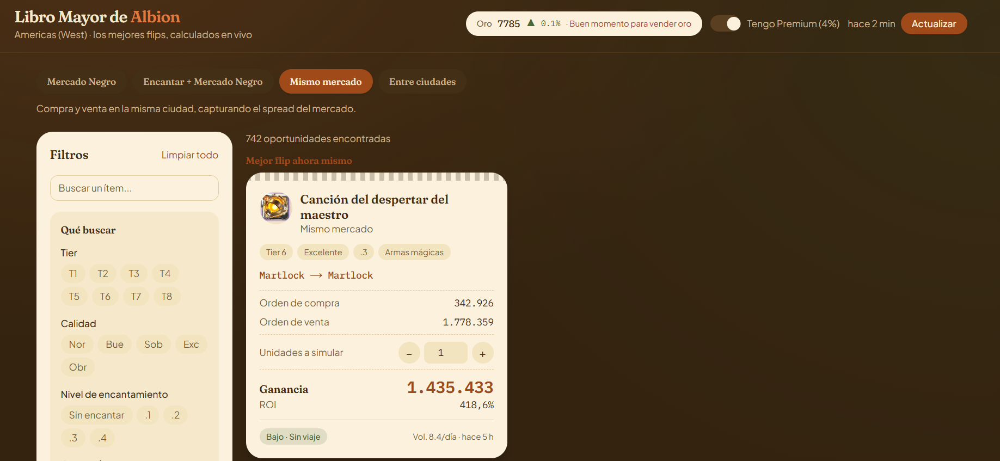

# Libro Mayor de Albion

**Buscador de oportunidades de reventa (flips) en tiempo real para el mercado de [Albion Online](https://albiononline.com/).**

Albion Online es un MMO con una economía 100% de jugadores: los precios cambian ciudad a ciudad y quien compra barato y vende caro vive de ello. El problema no es *conseguir* los precios —hay APIs públicas para eso— sino **decidir rápido cuál de los miles de items deja ganancia real después de impuestos, tasas y el viaje entre ciudades**. Esta herramienta hace ese cálculo en vivo y te muestra la decisión, no la hoja de cálculo.

<p align="center">
  <sub>Servidor Americas (West) · UI en español · desplegado en Vercel</sub>
</p>



> 🔗 **Demo:** [URL](https://albion-online-amber.vercel.app/)

---

## Qué hace

Consulta el mercado en vivo, calcula las mejores reventas del momento y las ordena por ganancia, ROI o liquidez. Cubre cuatro tipos de flip:

- **Misma ciudad** — aprovechar el diferencial entre orden de compra y orden de venta en un mismo mercado.
- **Entre ciudades** — arbitraje comprando en una ciudad y vendiendo en otra (teniendo en cuenta el viaje).
- **Mercado Negro directo** — comprar en una ciudad y venderle directo al NPC del Mercado Negro (exento de impuestos).
- **Encantar → Mercado Negro** — encantar un item con materiales y revenderlo encantado.

Cada oportunidad incluye la inversión, la ganancia neta, el ROI, un indicador de **riesgo** y de **liquidez** (volumen diario), y un "ticket" de detalle donde puedes **simular la cantidad** para ver la ganancia total. Arriba, un indicador del precio del **oro** sugiere si es buen momento para comprarlo o venderlo.

## Lo importante: la matemática es el producto

La ganancia real no es "precio de venta − precio de compra". El motor de cálculo modela las mecánicas de mercado de Albion:

- **Tasa de gestión (setup fee)** del 2.5 % al colocar órdenes.
- **Impuesto de venta** del 8 % (o 4 % con cuenta Premium).
- Diferencia entre **operar al instante** (contra una orden existente) y **dejar una orden** en el libro.
- El **Mercado Negro** es un NPC: exento de tasas e impuestos.
- **Viaje** entre ciudades reales o hacia Caerleon como factor de riesgo.

Todo eso se resuelve en el servidor sobre un catálogo de **~2.600 items** (que se expanden a **~7.700 variantes** con niveles de encantamiento) a través de las 8 ciudades del servidor.

## Cómo está construido

```
Albion Online Data API  →  capa de datos (fetch + caché)  →  motor de flips  →  API routes  →  dashboard React
```

- **Fuente de datos:** la API pública del [Albion Online Data Project](https://www.albion-online-data.com/).
- **Capa de datos** (`lib/albionApi.ts`, `lib/priceCache.ts`): descarga por lotes respetando el límite de longitud de URL de la API, con concurrencia acotada y reintentos con backoff. Encima, una **caché con TTL** (precios 10 min · historial/liquidez 60 min · oro 15 min) para no martillar la API en cada request.
- **Motor de flips** (`lib/flipEngine.ts`, `lib/fees.ts`): construye índices de precio y liquidez en memoria y genera las oportunidades ya calculadas (ganancia, ROI, riesgo, viaje, modo de ejecución).
- **API routes** (`app/api/flips`, `app/api/gold`): exponen los resultados ya filtrados y ordenados; el filtrado pesado ocurre en el servidor.
- **Dashboard** (`components/`): tabla, panel de filtros, ticket de detalle e indicador de oro, todo en cliente.

## Stack técnico

| Área | Herramienta |
|------|-------------|
| Framework | **Next.js 16** (App Router · Turbopack) |
| UI | **React 19** + **React Compiler** |
| Lenguaje | **TypeScript** |
| Estilos | **Tailwind CSS v4** (tokens con `@theme` y variables CSS) |
| Datos | Albion Online Data Project API |
| Deploy | **Vercel** |

## Detalles que cuidé

Más allá de que funcione, quise que se notara el oficio:

- **Sistema de diseño propio — "The Merchant's Ledger":** una estética de libro de contabilidad sobre escritorio de nogal (pergamino, recibos, sello de lacre terracota) en lugar del típico dashboard gris o del "neón gamer". El sistema visual está documentado aparte.
- **Accesibilidad WCAG AA:** contraste verificado en toda la paleta, foco visible, **tabla operable por teclado**, y el significado nunca depende solo del color (compra/venta y riesgo siempre llevan etiqueta).
- **Detalles de UX de "producto real":** panel de detalle con `<dialog>` nativo (Escape, trampa de foco y retorno de foco gratis), persistencia de filtros y pestaña en `localStorage`, búsqueda con *debounce*, estados de carga con *skeletons* y manejo honesto de errores con reintento.
- **Resiliencia en serverless:** la caché de mercado funciona con o sin sistema de archivos escribible (memoria + disco best-effort), para correr igual en un servidor persistente que en funciones serverless de solo lectura.

## Ejecutar en local

```bash
git clone https://github.com/aenami/Albion-online-flips.git
cd Albion-online-flips
npm install
npm run dev
```

Abre [http://localhost:3000](http://localhost:3000). No requiere claves ni variables de entorno: la API de datos es pública.

```bash
npm run build   # build de producción
npm run lint    # linter
```

---

<sub>Datos de mercado cortesía del **Albion Online Data Project**. Proyecto personal, sin afiliación con Sandbox Interactive. *Albion Online* es marca de Sandbox Interactive GmbH.</sub>
